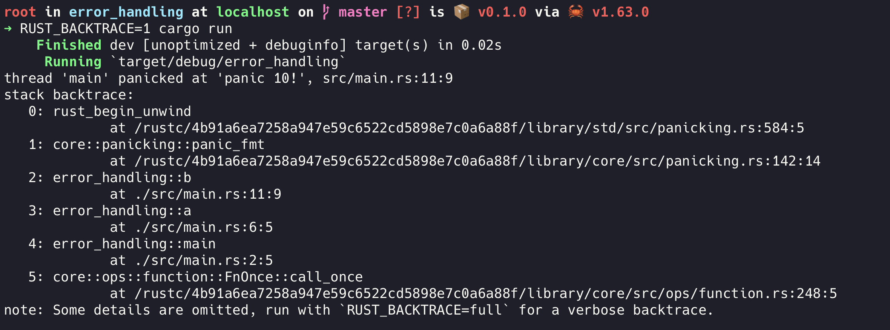

# Error handling 錯誤處理

在多數的程式語言當中，錯誤分成可預期的錯誤(exception)和不可預期的錯誤(unexception)，而後者會直接讓程式崩潰(crashing)。

在Rust當中也有一樣的概念，但不一樣的是，Rust將錯誤分成可回復的錯誤(recoverable errors)和不可回復錯誤(un-recoverable errors)。在繼續往下說明之前，先來看一段javascript的code

```
function test (isNumber) {
  try {
    if (isNumber === false) {
    	throw new Error("this is not a number");		
    }
    
    return { success: true, message: "this is a number" };
  } catch (e) {
    return { success: false, message: e.message }
  }
}
```

在function裡的邏輯被try / catch包住了，這是為了當發生可預期的錯誤時，並不會讓整個程式中斷，而且回傳自定義的格式，讓使用者可以清楚知道錯誤的訊息是什麼。
這邊的重點在於我們定義了當變數isNumber是false的時候程式不應該被**terminate**這件事。

然而在Rust中是沒有try / catch存在的，我們會把**isNumber**是**false**時的狀況定義成**可恢復的錯誤**(recoverable errors)。當發生可恢復的錯誤時，顧名思義並不會將程式**terminate**以外並讓我們可以決定錯誤發生時後續的處理。

在try / catch下，所有的error exception都是屬於不可回復的錯誤(un-recoverable)，意思就是會立即中斷程式防止城市繼續執行下去。

## panic!不可回復的錯誤

Rust提供panic!()巨集來處理不可回復的錯誤，當執行panic!()時，會印出錯誤的訊息並中斷程式，等同於try / catch中的 throw error，通常用於處理開發者不知道怎麼處理該狀況的錯誤。

```
fn main() {
    panic!("panic!!!!!");
}
```

執行上面的程式可以得到以下結果：


可以看到倒數第二行有顯示是在哪個檔案第幾行發生panic還有panic的內容。但我們得知的資訊也僅此而已，如果想知道是從哪個function出發或是經歷了哪些function才叫到這個含有panic的function呢？我們可以使用backtrack。

## panic! Backtrace

這邊再來看一段例子：

```
fn main() {
    a();
}

fn a() {
    b(10);
}

fn b(n: i32) {
    if n == 10 {
        panic!("panic 10!");
    }
}
```

執行 cargo run 後


我們可以看到倒數第二行一樣標示了錯誤在 src/main.rs 第11行。但如果這個function被很多地方複用了，光憑這樣的情報我們無法找出源頭在哪，究竟是哪個源頭導致的錯誤。這時候可以看到上圖中的最後一行有提示可以設定環境變數 RUST_BACKTRACE=1來取得backtrace得以知道錯誤發生時到底發生了什麼事。

執行 RUST_BACKTRACE=1 cargo run



這時就可以清楚看到，先是從function main → a → b 這樣的順序呼叫的。
閱讀backtrace需要找出一開始的檔案，以上述的例子就是main.rs，這就會是發生問題的源頭，這些行數可能也會包含Rust的核心程式碼，或是使用到的crate。

## Result 可回復的錯誤

並不是所有錯誤都需要中斷整個程式。假設我們要讀取一個txt檔案裡的文字，當文件不存在時，不特別處理做錯誤處理，執行讀取的程式會出現錯誤導致整的程式中斷。

```
fn read_file() {                                                                                     
     let mut f = File::open("hello.txt").expect("file not exist");                                    
     let mut s = String::new();                                                                       
     f.read_to_string(&mut s);                                                                        
     println!("{}", s);                                                                               
 }
```

執行後會出現


當檔案不存在時，可能會想建立一個新的檔案而不是中斷程式。這邊可以使用Rust提供其中一個枚舉(Enum) Result

```
enum Result<T, E> {
    Ok(T),
    Err(E)
}
```

T和E是泛型別的參數，當成功時OK會回傳T的型別，而E則代表帶失敗時Err會回傳的錯誤型別。

上面所使用到的File::open回傳的就是Result型別，可以看到倒數第三行有顯示錯誤型別 kind 和 message的資訊。

那要如何知道該函式回傳的是何種類型資料呢？

1. 編輯器提供的Go to definition


上圖可以看到回傳的資料型別是 Result<File>

1. 賦予變數資料型別，讓編譯器告訴你

```
let mut f: i32 = File::open("hello.txt");
```

給f變數 i32的型態，這時編譯器會出現以下錯誤


當File::open 成功的話 f 變數就是可以讀寫檔案的控制程式，而失敗的話則是錯誤的資訊，可能是檔案不存在，也可能是沒有權限，我們可以依據何種錯誤來決定後續的處理方式。

接下來將Result加進程式碼中

```
let f = match File::open("hello.txt") {                            
         Ok(file) => file,                                                                            
         Err(error) => match error.kind() {                                                           
             ErrorKind::NotFound => match File::create("hello.txt") {                                 
                 Ok(file) => file,                                                                    
                 Err(error) => panic!("建立檔案時發生問題：{:?}", error)                              
             },                                                                                       
             ErrorKind::PermissionDenied => panic!("沒有檔案權限"),                                   
             _ => panic!("WTF")                                                                       
         }                                                                                            
     };
```

首先當讀取檔案失敗時，會先看失敗的理由是什麼，如果是檔案不存在的話會建立檔案，檔案建立失敗的話會中斷程式。而沒有權限的話也會中斷程式。

這邊還可以注意到第19行，有的底線符號，意思就是match不到的錯誤要做的處理方式，Rust編譯器會檢查是不是有漏掉的可能性，如果有在編譯的時候就會有錯誤。


當match Result資料型態時只會有Ok & Err 所以不用加上底線。

## unwrap & expect

有另一種情況是，如果失敗就要中斷，沒有補救的方法的話使用match的方法會顯得特別的冗長，因此Rust提供了unwrap的方法。

```
let f = File::open("hello.txt").unwrap();
```


若讀取檔案時拜就會直接呼叫panic!()，但這樣錯誤的資訊又不太明確，另一方式expect就可以顯示自定義的文字。

```
let f = File::open("hello.txt").expect("file not exist");
```


## ？運算子

Rust提供了另一種更簡潔的做法，與match當方法類似，若成功就return Ok錯誤則return Err，將錯誤處理丟給呼叫此程式去處理。

```
fn main() { ▶︎ Run  | Debug                                                                           
     let txt_content = match read_file() {                                                                 
         Ok(s) => s,                                                                                  
         Err(e) => panic!("可能是檔案不存在或是讀取檔案內容失敗")                                     
     };                                                                                               
                                                                                                      
     println!("{}", txt_content);                                                                          
 }                                                                                                    
                                                                                                      
 fn read_file () -> Result<String, io::Error> {                                                       
     let mut s = String::new();                                                                       
     File::open("hello.txt")?.read_to_string(&mut s)?;                                                
                                                                                                      
     Ok(s)                                                                                            
 }
```

簡單來說就是只要失敗就直接return不會繼續執行下去。

成功的結果


失敗的結果


要特別注意的是 ? 只能使用在會return Result或Option的函式中，編譯器會提醒。


source: [https://doc.rust-lang.org/book/ch09-00-error-handling.html](https://doc.rust-lang.org/book/ch09-00-error-handling.html)
